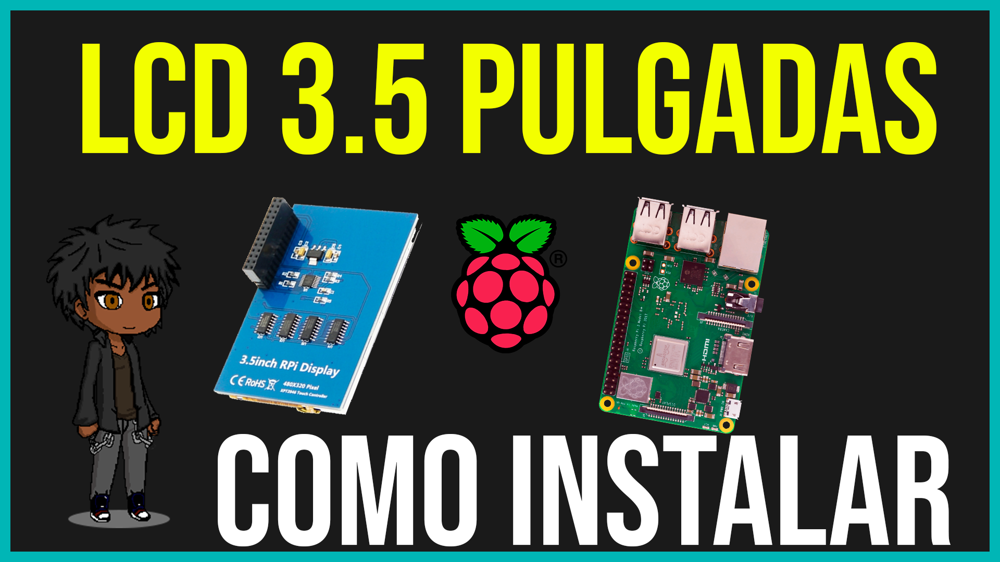

# RaspberryPi3bplus-3.5inch-displayA-ILI9486-MPI3501-XPT2046
Error pantalla con _ parpadeante. Solución. SO 64bits y 32bits.

Esto fue testeado en la versión Bookworm y Bullseye tanto de 32 como de 64 bits.
El error se repite en otros tipos de pantalla, pero el procedimiento seria el mismo.

<div align="center">

<h3>Si te gustaría ver un video sobre como lo solucione da click acá:</h3>

<a href="https://youtu.be/3FgEISmO2sI"></a>
<br>
***No te olvides de suscribirte y dar me gusta.***

</div>

Si desean clonar este repositorio que solo viene preparado para la versión de pantalla que se encuentra en el titulo pueden reemplazar el primer comando por:

```bash
sudo rm -rf LCD-show
git clone https://github.com/Shinigamy19/RaspberryPi3bplus-3.5inch-displayA-ILI9486-MPI3501-XPT2046
chmod -R 755 LCD-show
cd RaspberryPi3bplus-3.5inch-displayA-ILI9486-MPI3501-XPT2046/
```

Aunque este sea más ligero ya que solo tiene este controlador, recomiendo usar el oficial.

> Voy a dejar más información respecto de todo el proceso al final del post.

# Requisitos

- Montar la imagen de Raspberry pi os (ex raspbian) con Pinn Multiboot, montando una imagen o usando la herramienta de <a href="https://www.raspberrypi.com/software/">Raspberry Software</a> 

- Conexión por hdmi, un teclado y mouse para primer inicio del OS. (Después lo pueden usar remoto o vía ssh)

- Contar con conexión a internet en su Raspberry Pi.

- Tener habilitado SSH y SPI.

Yo utilizo <a href="https://www.putty.org/">Putty</a> y <a href="https://www.realvnc.com/es/connect/download/viewer/">VNC Viewer</a> para mayor comodidad.
También les dejo un teclado en pantalla por si necesitan.

```bash
sudo apt-get install update
sudo apt-get install matchbox-keyboard
```

# Comandos

```bash
sudo rm -rf LCD-show
git clone https://github.com/goodtft/LCD-show.git
chmod -R 755 LCD-show
```

Antes de continuar no se olviden de tener activa la conexión por ssh ya que al hacer esto la interface de nuestro OS no se volverá a mostrar hasta que hayamos configurado todo lo posterior.
En caso de no ser posible una conexión mediante ssh, después de hacer el siguiente paso podrían poner la memoria en su sistema operativo y des comentar la línea `dtoverlay=vc4-kms-v3d` para volver a ver la pantalla HDMI. (Hay que recordar volver a comentarlo una vez se solucione el problema de la pantalla de 3.5)

```bash
cd LCD-show/
sudo ./LCD35-show
```

Ahora si nos conectamos por ssh y ejecutamos el siguiente comando:

```bash
sudo systemctl disable glamor-test.service
sudo rm /usr/share/X11/xorg.conf.d/20-noglamor.conf
sudo systemctl restart lightdm
```

Con esto detenemos el proceso de Glamor que genera que en dispositivos de hasta  1gb de ram se detengan procesos, concretamente uno de los afectados es el que corresponde con el controlador de pantalla. Por eso al desactivarlo la pantalla inicia normalmente.
> Mas información al final del post.

Recorda que `dtoverlay=vc4-kms-v3d` debe estar comentado en /boot/config.txt.

Para cambiar la resolución ejecutamos:

```bash
sudo nano /boot/config.txt
```

al final de todo este documento agregamos cualquiera de estas resoluciones y la des comentamos.

```bash
#framebuffer_width=720
#framebuffer_height=480

#framebuffer_width=960
#framebuffer_height=640

#framebuffer_width=1440
#framebuffer_height=960

#framebuffer_width=1920
#framebuffer_height=1280
```

Yo particularmente uso:

```bash
framebuffer_width=960
framebuffer_height=640
```

Para guardar el documento apretamos Control (cmd) + O y luego Control + X

Deje varias resoluciones para que elijan la que necesiten.
Recuerden que para que los cambios hagan efecto tiene que hacer un:

```bash
sudo reboot
```

Para calibrar la pantalla tactil:

```bash
sudo apt-get install xinput-calibrator 

sudo nano /etc/X11/xorg.conf.d/99-calibration.conf
```

Si necesitan rotar la pantalla:

```bash
cd LCD-show/
sudo ./rotate.sh 90
```

con mi repo:

```bash
cd RaspberryPi3bplus-3.5inch-displayA-ILI9486-MPI3501-XPT2046/
sudo ./rotate.sh 90
```

Y eso sería todo lo que hay que hacer.

Si por alguna razón ya no quieren usar su pantalla de 3.5 pulgadas pueden ejecutar el siguiente comando y funcionara con el hdmi.

```bash
chmod -R 755 LCD-show
cd LCD-show/
sudo ./LCD-hdmi
```

Si estas usando este repo:
```bash
chmod -R 755 LCD-show
cd RaspberryPi3bplus-3.5inch-displayA-ILI9486-MPI3501-XPT2046/
sudo ./LCD-hdmi
```

# Queres apoyarme:

<h3 align="center">Mis redes sociales:</h3>
<p align="center">
<a href="https://www.youtube.com/c/shinigamy19" target="blank"></a>
<a href="https://twitch.tv/shinigamy_19" target="blank"></a>
<a href="https://kick.com/shinigamy19" target="blank"></a>
<a href="https://discord.gg/px9fcpbp3T" target="blank"></a>
<a href="https://instagram.com/shinigamy19_art" target="blank"></a>
<a href="https://instagram.com/shinigamy19" target="blank"></a>
<a href="https://www.tiktok.com/@shinigamy_19" target="blank"></a>
<a href="https://linkedin.com/in/eros-benitez" target="blank"></a>
<a href="https://www.behance.net/shinigamy19" target="blank"></a>
<a href="https://shinigamy19.itch.io/" target="blank"></a>
<a href="https://fb.com/shinigamy19" target="blank"></a>
<a href="mailto:erosbenitezd@gmail.com" target="blank"></a>
</p>

<div>
<h3 align="center">Donaciones:</h3>
<p align="center">
<a href="https://ceneka.net/mp/d/shinigamy19" target="blank"></a>
<a href="https://www.paypal.me/shinigamy19" target="blank"></a>
<a href="https://www.patreon.com/shinigamy19" target="blank"></a>

</p>
<p align="center">
<a href='https://cafecito.app/shinigamy19' rel='noopener' target='_blank'></a></p>
</div>

# Creditos

Toda la documentación relacionada la pueden encontrar en:
https://github.com/goodtft/LCD-show/

Los overlays de este repositorio fueron obtenidos de dicho directorio.

Si tenes una pantalla Waveshare:
https://github.com/waveshare/LCD-show.git

También les dejo este pequeño foro de donde saque la información del proceso Glamor.
https://github.com/goodtft/LCD-show/issues/369


